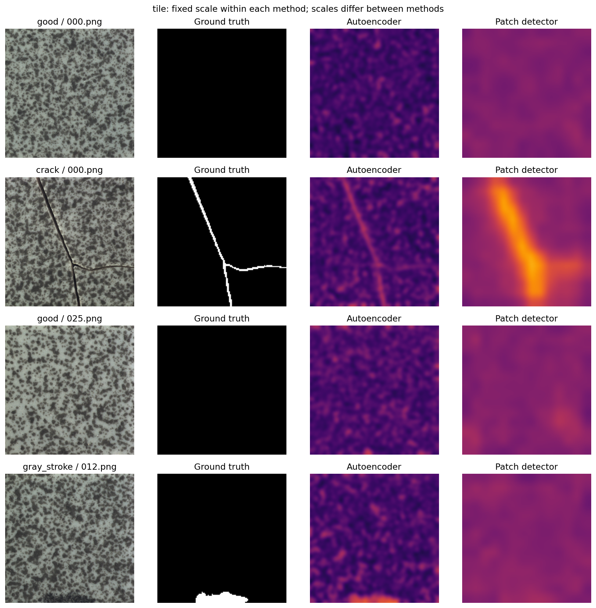

# Industrial Visual Anomaly Detection

Detecting defective products using normal images for training, with a comparison of pretrained image features, an autoencoder and a PatchCore-inspired detector.

I wanted to investigate whether local image features are more useful for detecting manufacturing defects than whole-image features or reconstruction error. I evaluated three methods on the **bottle, metal nut and tile** categories of MVTec AD, covering 315 test images.

**Main finding:** the PatchCore-inspired method achieved a macro-average image AUROC of **0.9911**, compared with **0.9071** for the image-feature baseline and **0.6134** for the autoencoder. These are results from one fixed split and one seed. AUROC measures ranking performance; it is not classification accuracy.

## Methods

| Method | Approach |
| --- | --- |
| Image-feature baseline | Normalised ImageNet-pretrained ResNet18 embeddings, scored by distance to the nearest normal fitting image. |
| Autoencoder | A convolutional encoder–decoder trained from scratch on normal images. Reconstruction error produces an anomaly map. |
| PatchCore-inspired | Intermediate ResNet18 patch features compared with a compact memory bank of normal patches. |

The patch method is a simplified implementation inspired by PatchCore, not an official reproduction. It uses a 14 × 14 patch grid, at most 3,000 candidate patches, a 64-dimensional random projection and a bank of up to 256 patches. It does not implement the original image-score reweighting. Both spatial methods use the mean of the highest-scoring 1% of map pixels as their image score.

The feature methods use external ImageNet pretraining; the autoencoder does not. The comparison therefore concerns these complete pipelines rather than architectures with identical training histories.

## Evaluation setup

I retained the official test images and split the normal training images into fitting, validation and calibration sets. Validation reconstruction loss selects the autoencoder checkpoint. Each method's decision threshold is the 95th percentile of its normal calibration scores; scores above that threshold are flagged as defects.

| Category | Fitting | Validation | Calibration | Normal test | Defective test |
| --- | ---: | ---: | ---: | ---: | ---: |
| Bottle | 146 | 31 | 32 | 20 | 63 |
| Metal nut | 154 | 33 | 33 | 22 | 93 |
| Tile | 161 | 34 | 35 | 33 | 84 |

- Split and experiment seed: **42**.
- Image resolution: **224 × 224**, resized without cropping.
- Pixel evaluation resolution: **128 × 128**.
- Autoencoder budget: up to **20 epochs**, with early stopping after four epochs without validation improvement.
- Completed epochs: bottle **20**, metal nut **20**, tile **10**. Evaluation uses the best validation checkpoint.
- Recorded execution device: **CPU**.

The saved manifest contains no file paths shared across splits. This path check does not establish the absence of duplicate image content. Test labels are used for evaluation, not threshold selection or early stopping.

## Results

### Image AUROC

Higher values indicate better separation between normal and defective images.

| Method | Bottle | Metal nut | Tile | Macro mean |
| --- | ---: | ---: | ---: | ---: |
| Image-feature baseline | 0.9913 | 0.7600 | 0.9701 | 0.9071 |
| Autoencoder | 0.7190 | 0.2957 | 0.8254 | 0.6134 |
| **PatchCore-inspired** | **1.0000** | **0.9751** | **0.9982** | **0.9911** |

The macro mean gives each category equal weight. All nine image AUROC and average-precision values, and their confusion matrices, were checked against the saved per-image predictions.

### Patch detector at the calibration thresholds

| Category | Defects detected | Defects missed | False alarms on normal images |
| --- | ---: | ---: | ---: |
| Bottle | 63/63 | 0 | 0/20 |
| Metal nut | 87/93 | 6 | 2/22 |
| Tile | 83/84 | 1 | 1/33 |

The bottle result is perfect on this particular test set, not evidence of perfect performance on new data. Normal-only calibration also did not guarantee a 5% test false-positive rate: it reached 9.09% for metal nuts.

### Patch detector localisation

| Category | Pixel AUROC | Pixel average precision |
| --- | ---: | ---: |
| Bottle | 0.9799 | 0.7010 |
| Metal nut | 0.9715 | 0.8401 |
| Tile | 0.9384 | 0.4093 |

These metrics pool pixels across each category's test images, including normal images. They are measured at reduced resolution and should not be compared directly with native-resolution benchmark results.

## What I found

Local patch features produced the strongest image-level results across all three categories. Their largest improvement over global features was on metal nuts. The patch detector still missed two bent, two colour and two scratch defects in that category, and one grey-stroke defect on tiles.

The autoencoder was a weak detector in this setup, particularly on metal nuts, where its AUROC fell below 0.5. Its maps often responded to ordinary edges and texture as well as defects. That observation suggests a limitation of reconstruction error here, but does not by itself establish the cause of the poor ranking.

Detecting a defective image was easier than tracing its exact defect boundary. For tiles, image AUROC was 0.9982 but pixel average precision was 0.4093. The gallery below shows the patch detector responding broadly around a crack. It also includes a high-scoring normal image and a low-scoring defective image, selected using the patch detector's scores.

Colour scales are fixed within each method and category, but differ between methods. Brightness should not be compared directly across the autoencoder and patch-detector columns.

Additional figures: [bottles](results/bottle_error_gallery.png), [metal nuts](results/metal_nut_error_gallery.png), and [autoencoder validation loss](results/autoencoder_validation_loss.png).

## Run in Kaggle

1. Import [the notebook](notebooks/industrial_anomaly_detection.ipynb) into Kaggle.
2. Attach the [MVTec AD dataset](https://www.kaggle.com/datasets/ipythonx/mvtec-ad). The input must include extracted category folders with `train`, `test` and `ground_truth`.
3. Download the official [ResNet18 weights](https://download.pytorch.org/models/resnet18-f37072fd.pth) and attach that file as a separate private Kaggle input.
4. Leave `DATA_ROOT = None` and `WEIGHTS_PATH = None` for automatic detection.
5. Keep `RUN_MODE = "standard"` and run all cells. Notebook Internet access is not required. A GPU is optional.
6. Download the new `anomaly_results.zip` and the executed notebook separately.

`quick` is a setup check with one category and three training epochs. `study` evaluates fitting-data fractions of 10%, 25%, 50% and 100% with seeds 42, 123 and 2026. **The results committed here are from standard mode; the larger study has not been run.**

The source notebook in this package has cleared outputs. The completed run is recorded in the result files. An executed notebook can be exported from Kaggle and used to replace the source notebook at the same path.

Recorded versions include Python 3.12.13, PyTorch 2.10.0+cpu, torchvision 0.25.0+cpu, NumPy 2.0.2 and pandas 2.3.3. Other imported packages are Pillow, SciPy, scikit-learn, Matplotlib and tqdm; their versions were not captured in this run. Exact results can vary across environments.

## Repository contents

| Location | Contents |
| --- | --- |
| `notebooks/` | Kaggle notebook with training, evaluation and an optional inference example. |
| `results/metrics.csv` | All category and method metrics, thresholds and timings. |
| `results/test_predictions.csv` | Per-image anomaly scores and decisions. |
| `results/split_manifest.csv` | Original Kaggle paths and split assignments. |
| `results/training_history.csv` | Autoencoder training and validation losses. |
| `results/settings.json` and `results/environment.json` | Experiment settings and recorded environment. |
| `results/*.png` | Error galleries and validation-loss plot. |
| `models/<category>_seed42_fraction1/` | Three fitted detector checkpoints per category. |

The `.pt` files contain the autoencoder state or memory bank, plus the selected threshold and settings. Feature detectors also require the separate pretrained ResNet18 weights. To reuse a checkpoint, run the notebook definitions and set `NEW_IMAGE` and `CHECKPOINT` in its optional inference cell. Load only trusted checkpoints.

Fit times exclude shared feature extraction. Feature-method prediction times use cached embeddings; autoencoder prediction times include image loading and forward passes. The saved timings are not end-to-end speed comparisons.

## Limitations and further work

This is a three-category, single-seed benchmark experiment. It does not establish performance across factories, cameras or lighting conditions. Resizing may hide small defects, and strong pooled metrics can conceal failures on individual images. The normal calibration sets are small, so operating-point estimates are uncertain.

The next planned extension is the training-fraction and multi-seed study, followed by evaluation on independent data. If I redesign the method after inspecting these test failures, I need fresh evaluation data before claiming improved generalisation. I have not carried out a statistical-significance analysis.

## Dataset attribution and references

MVTec AD is provided by MVTec Software GmbH under **CC BY-NC-SA 4.0**. This project is a noncommercial educational experiment. The galleries contain resized dataset images and masks with generated anomaly maps; those visualisations retain the dataset attribution and are shared under the same licence. The raw image dataset and pretrained ResNet18 weights are not bundled here. No separate licence grant for the original code is asserted by this README.

- Bergmann et al. (2019), *MVTec AD — A Comprehensive Real-World Dataset for Unsupervised Anomaly Detection*. [Official dataset and licence](https://www.mvtec.com/research-teaching/datasets/mvtec-ad).
- Roth et al. (2022), *Towards Total Recall in Industrial Anomaly Detection*. [Paper](https://openaccess.thecvf.com/content/CVPR2022/html/Roth_Towards_Total_Recall_in_Industrial_Anomaly_Detection_CVPR_2022_paper.html).
- [Torchvision ResNet18 documentation](https://docs.pytorch.org/vision/stable/models/generated/torchvision.models.resnet18.html).
- [Creative Commons BY-NC-SA 4.0](https://creativecommons.org/licenses/by-nc-sa/4.0/).
